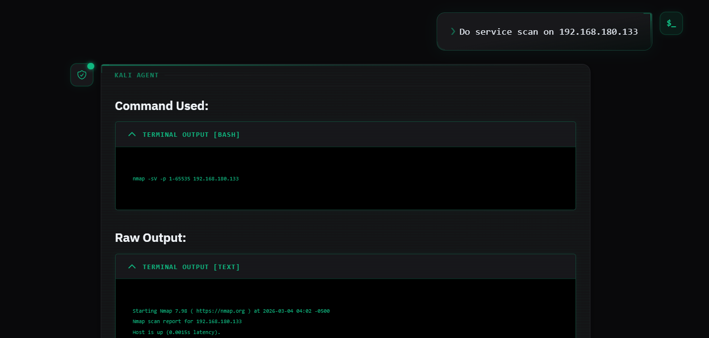

<div align="center">
  <h1> KALI SMCP-C</h1>
  <p><strong>Kali Simple Model Context Protocol - Client</strong></p>
  <p>A zero-trust, multi-LLM web application designed for cybersecurity professionals to orchestrate, execute, and analyze remote Kali Linux security tools via the Model Context Protocol (MCP).</p>
</div>

<hr/>



## 🚀 Overview

**KALI-SMCP-C** acts as a simple MCP client to use with Kali Linux. It seamlessly translates natural language commands into actionable execution of tools (like Nmap, Gobuster, Nikto, Metasploit) using the Model Context Protocol.

Built with a lightning-fast SvelteKit frontend and a robust Python FastAPI backend, it supports dynamic routing across multiple LLM providers (Claude, ChatGPT, Gemini, Ollama), ensuring you have the right intelligence engine for the right task.

## ✨ Features

*   **🧠 Multi-LLM Engine:** Dynamically switch between **Claude** (Anthropic), **ChatGPT** (OpenAI), **Gemini** (Google), or entirely local models via **Ollama**.
*   **📡 Real-Time Status Tracking:** Live polling for API key health and LLM availability directly in the UI header.
*   **🖥️ Live CLI Streaming:** Watch long-running tools (like `-sV` version scans) progress in real-time. Actionable CLI commands are reconstructed and displayed before output.
*   **📂 Saved Chats:** Keep multiple chat threads going at once, and never lose your tool output history even if you refresh the page.


## 🛠️ Tech Stack

*   **Frontend:** SvelteKit 5, Tailwind CSS v4, `marked` (Markdown parsing)
*   **Backend:** Python 3.13, FastAPI, SQLite3 (Storage), LangChain
*   **AI Providers:** Anthropic API, OpenAI API, Google Generative AI, Ollama
*   **Protocol:** MCP (`mcp-client` via `stdio` bindings) mapping strictly to a remote Kali Python Flask server.

---

## 📦 Installation & Setup

Ensure you have both **Node.js** (v22+) and **Python** (v3.13+) installed on your local control machine.

### 1. Clone the repository
```bash
git clone <your-repo-url>
cd Kali-SMCP-C
```

### 2. Frontend Setup
```bash
npm install
```

### 3. Backend Setup
Navigate to the `backend/` directory, create a virtual environment, and install the dependencies:
```bash
cd backend
python -m venv venv

# Windows
venv\Scripts\activate
# Linux/macOS
source venv/bin/activate

pip install -r requirements.txt
```

---

## ⚙️ Configuration

The backend relies on environment variables for API keys and targeting the remote Kali MCP server. 

Create a `.env` file inside the `backend/` folder. The system is designed to **hot-reload** this configuration, meaning you can update API keys or change models on-the-fly without restarting the backend!

### Example `backend/.env`

```ini
# Instructions: Copy this file to `.env` and fill in your keys.

# --- MCP Target ---
# Point this to your remote Kali Linux machine running the MCP Host server
MCP_SERVER_URL="http://<YOUR-KALI-MCP-SERVER>:5000"

# --- LLM: Anthropic Claude ---
ANTHROPIC_API_KEY=""
CLAUDE_MODEL="claude-3-haiku-20240307"

...
# --- LLM: Ollama (Local/Self-Hosted) ---
OLLAMA_BASE_URL="http://localhost:11434"
OLLAMA_MODEL="qwen3:8b"

# --- Advanced Options ---
# Optional: Set global timeout for long running tools (seconds)
# REQUEST_TIMEOUT="300"

```

---

## ⚡ Running the Application

You can run both the Frontend (Vite) and Backend (Uvicorn) servers simultaneously using NPM scripts.

From the **root `Kali-SMCP-C/` directory**, simply run:

```bash
# To run Development mode (Hot-Module Replacement active)
npm run dev
```

The system will be accessible at `http://localhost:5173/`. Ensure your backend `.env` is configured and your remote Kali MCP server is online before dispatching commands.

### Production Build
If you want to build and test the production optimized payload:
```bash
npm run build
npm run start:prod
```
The system will be accessible at `http://localhost:3000/`

---

## ⚠️ Disclaimer

This tool is designed strictly for **authorized penetration testing and educational purposes only**. The developers assume no liability and are not responsible for any misuse or damage caused by this program. Ensure you have explicit, authorized permission to target the networks and systems you interact with via this console.
